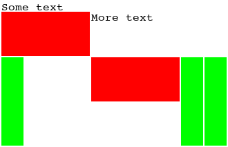

imagetable
==========

Create an HTML-like table from images and text, then render the whole thing as an image.

Example
-------
	
	import imagetable
	from PIL import Image

	red_fat = Image.new('RGB', (128, 64), color=(255, 0, 0, 255))
	green_thin = Image.new('RGB', (32, 128), color=(0, 255, 0, 255))
	tbl = imagetable.ImageTable()
	tbl.td('Some text')
	tbl.tr()
	tbl.td(red_fat)
	tbl.td('More text')
	tbl.tr()
	tbl.td(green_thin)
	tbl.td(red_fat)
	tbl.td(green_thin)
	tbl.td(green_thin)
	tbl.image().save('table.png')

This script will generate the following image:

